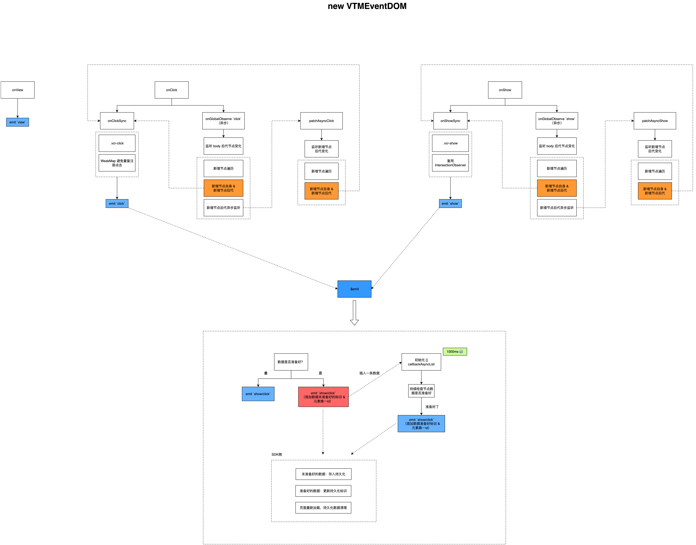

说明：一个“支持各种框架（vue,react,jquery）”浏览、点击、曝光的全埋点SDK，可打开index.html查看示例（支持同步、异步、增量、存量节点的监听）

运行步骤：

1、安装依赖：npm install

2、Demo：打开 index.html

3、F12打开开发者工具 Console-控制台

4、刷新页面，查看事件日志

- 浏览事件：页面一打开触发

- 点击事件：点击触发

- 曝光事件：滑动到页面底部查看需要曝光的元素

